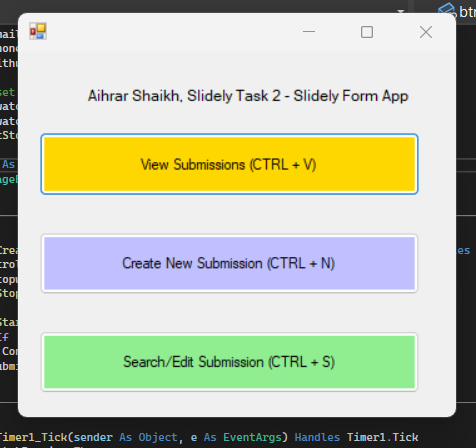
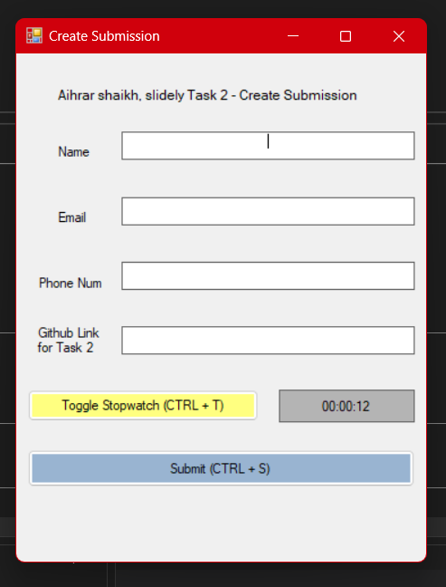
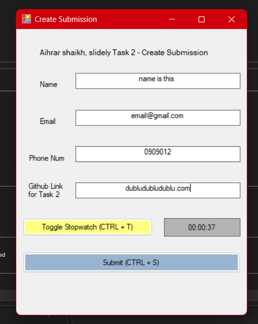
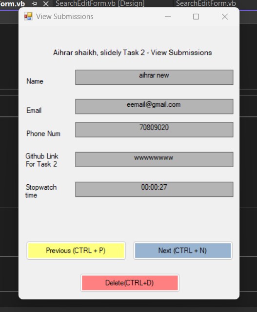
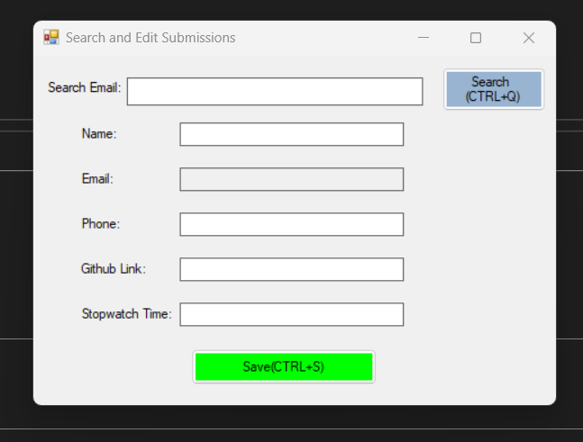
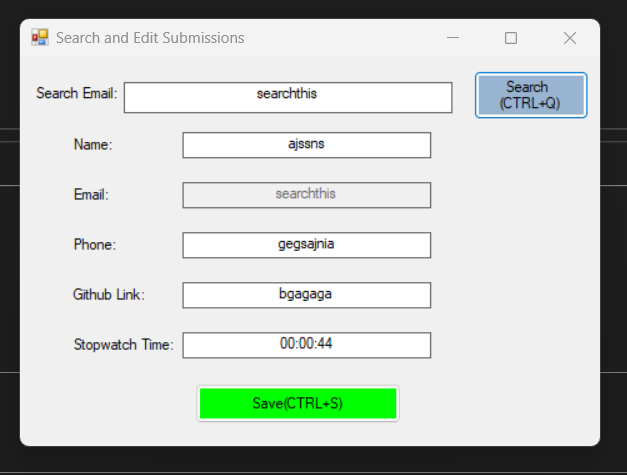

# Slidely Windows App

## Features

- **Create New Submission**: Allows the user to create a new submission with details such as name, email, phone, GitHub link, and stopwatch time.
- **View Submissions**: Displays a list of all submissions.
- **Search and Edit Submission**: Allows the user to search for a submission by email and edit the details.
  
## Installation

1. Clone the repository:
    ```sh
    git clone https://github.com/Aihrarshaikh/slidelytask.git
    cd slidelytask
    ```

2. Open the project in Visual Studio

3. Build the project to resolve dependencies and compile the application.

## Running the Application

1. Clone the backend repository and start the server
2. Run the application from your IDE.
3. Use the main form to navigate through the features:
    - **View Submissions**: View all existing submissions.
    - **Create New Submission**: Create a new submission.
    - **Search and Edit Submission**: Search for a submission by email and edit the details.

4. Open the project in your preferred IDE (e.g., Visual Studio).

5. Build the project to resolve dependencies and compile the application.

## Running the Application

1. Run the application from your IDE.
2. Use the main form to navigate through the features:
    - **View Submissions**: View all existing submissions.
    - **Create New Submission**: Create a new submission.
    - **Search and Edit Submission**: Search for a submission by email and edit the details.

## Screenshots

### Main Form


## Create Submissions 1


## Create Submissions 2


### View and Delete 1


### Search and Edit 1


### Search and Edit 2

